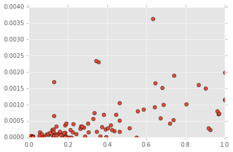
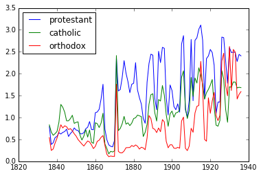

# Victoria II game save file parser 

It can be used to parse the save file of the brilliant game Victoria II built by Parodox.

## Example

Let's see the relationship between gdp(this use `a_actual_sold_domestic` to model it) and literacy.

Let's run a OLS to examine it (However it's not a proper model anyway).

									  OLS Regression Results                              
		==================================================================================
		Dep. Variable:     a_actual_sold_domestic   R-squared:                       0.311
		Model:                                OLS   Adj. R-squared:                  0.303
		Method:                     Least Squares   F-statistic:                     41.91
		Date:                    Thu, 10 Mar 2016   Prob (F-statistic):           4.44e-09
		Time:                            12:58:35   Log-Likelihood:                 582.40
		No. Observations:                      95   AIC:                            -1161.
		Df Residuals:                          93   BIC:                            -1156.
		Df Model:                               1                                         
		Covariance Type:                nonrobust                                         
		==============================================================================
						 coef    std err          t      P>|t|      [95.0% Conf. Int.]
		------------------------------------------------------------------------------
		Intercept   4.122e-05   8.69e-05      0.474      0.636        -0.000     0.000
		literacy       0.0012      0.000      6.474      0.000         0.001     0.002
		==============================================================================
		Omnibus:                       77.829   Durbin-Watson:                   2.011
		Prob(Omnibus):                  0.000   Jarque-Bera (JB):              511.952
		Skew:                           2.687   Prob(JB):                    6.78e-112
		Kurtosis:                      13.023   Cond. No.                         3.99
		==============================================================================
		
		Warnings:
		[1] Standard Errors assume that the covariance matrix of the errors is correctly specified.

The average income about Christianity.

## API

### script/select2.py

`parse(fname)`

		In [10]: rd=parse('../SPA1901_09_28.v2')
		
`rd` is a big dictionary saved a lot of information about savefile.

		In [11]: rd.keys()
		Out[11]: ['province', 'building', 'worldmarket', 'country', 'pop', 'state']
		
if you prefer to look at market price.
		
		In [12]: rd['worldmarket'].keys()
		Out[12]: 
		['last_price_history',
		 'last_supply_pool',
		 'actual_sold',
		 'player_balance',
		 'price_change',
		 'demand',
		 'player_pops_consumption_cache',
		 'price_pool',
		 'discovered_goods',
		 'real_demand',
		 'supply_pool',
		 'price_history',
		 'worldmarket_pool',
		 'price_history_last_update',
		 'actual_sold_world']

		In [13]: rd['worldmarket']['price_pool']
		Out[13]: 
		{'aeroplanes': 157.31616,
		 'ammunition': 17.20972,
		 'artillery': 54.37451,
		 'automobiles': 117.90674,
		 'barrels': 98.0,
		 'canned_food': 15.81982,
		 'cattle': 2.03003,
		 'cement': 14.24829,
		 'clipper_convoy': 34.28247,
		 'coal': 2.26996,
		 'coffee': 2.05997,
		 'cotton': 2.03003,
		 'dye': 12.0,
		 'electric_gear': 26.48022,
		 'explosives': 18.96899,
		 'fabric': 1.66986,
		 'fertilizer': 8.94897,
		 'fish': 1.51001,
		 'fruit': 1.78998,
		 'fuel': 20.40552,
		 'furniture': 4.31943,
		 'glass': 2.56967,
		 'grain': 2.19,
		 'iron': 3.46997,
		 'liquor': 6.10971,
		 'lumber': 0.81982,
		 'luxury_clothes': 64.14917,
		 'luxury_furniture': 55.44653,
		 'machine_parts': 35.11865,
		 'oil': 11.90991,
		 'opium': 3.20001,
		 'paper': 3.02963,
		 'precious_metal': 8.0,
		 'radio': 16.0,
		 'regular_clothes': 5.35956,
		 'rubber': 7.56055,
		 'silk': 12.21216,
		 'small_arms': 30.19336,
		 'steamer_convoy': 55.81104,
		 'steel': 4.28961,
		 'sulphur': 6.03003,
		 'tea': 2.98038,
		 'telephones': 14.09814,
		 'timber': 0.89999,
		 'tobacco': 1.07999,
		 'tropical_wood': 5.45004,
		 'wine': 8.27863,
		 'wool': 0.70001}
		 
Or you like to see pop counts.

		In [16]: len(rd['pop'])
		Out[16]: 30242
		
Pop attributes`(('block'),number)` means this is a block that is not parsed currently. 
It's important because I use a convenient but low efficiency method to load file. 
The `number` indicate the block location in origin file , so you can use other method to parse it .

		In [17]: rd['pop'].values()[0]
		Out[17]: 
		{'_index': 952980,
		 'bank': 0.01599,
		 'con': 1.09253,
		 'con_factor': 0.01331,
		 'country': 'AFG',
		 'id': 2,
		 'ideology': ('block', 952986),
		 'issues': ('block', 952993),
		 'literacy': 0.3226,
		 'luxury_needs': 0.19043,
		 'money': 174.56357,
		 'nation': 'pashtun',
		 'promoted': 1,
		 'province': '1217',
		 'random': 969,
		 'religion': 'sunni',
		 'size': 2035,
		 'type': 'bureaucrats'}
		 
state,province,building,country...

		In [18]: rd['state'].values()[0]
		Out[18]: 
		{'_index': 2561640,
		 'country': 'D02',
		 'id': '1383',
		 'provinces': ['1773', '1774'],
		 'type': '47'}

		In [19]: rd['province'].values()[0]
		Out[19]: 
		{'_index': 278875,
		 'artisans': ('block', 278895),
		 'building_construction': ('block', 279502),
		 'clergymen': ('block', 278964),
		 'controller': '"RUS"',
		 'core': '"SWE"',
		 'craftsmen': ('block', [279018, 279074]),
		 'fort': ('block', 278884),
		 'garrison': 100.0,
		 'id': '344',
		 'infrastructure': 0.64,
		 'labourers': ('block', [279129, 279186, 279236, 279292, 279332]),
		 'last_imigration': '"1901.9.19"',
		 'life_rating': 35,
		 'modifier': ('block', 278890),
		 'name': '"\xba\xa3\xc3\xc5\xc1\xd6\xc4\xc9"',
		 'officers': ('block', 279388),
		 'owner': '"RUS"',
		 'party_loyalty': ('block', 279580),
		 'pop': [7898,
		  7897,
		  872515,
		  1208059,
		  7900,
		  381843,
		  390473,
		  778502,
		  1237138,
		  768117,
		  7899],
		 'railroad': ('block', 278887),
		 'rgo': ('block', 279515),
		 'soldiers': ('block', 279447),
		 'state': '666'}
		 
		In [21]: rd['building'][0]
		Out[21]: 
		{'_index': 2016316,
		 'building': '"canned_food_factory"',
		 'country': 'ENG',
		 'employment': {'employees': ('block', 2016331), 'state_province_id': 203},
		 'injected_days': 0,
		 'injected_money': 0.0,
		 'last_income': 60630.82886,
		 'last_investment': 0.0,
		 'last_spending': 41509.33838,
		 'leftover': 0.0,
		 'level': 1,
		 'money': 1000000.0,
		 'pops_paychecks': 4871.40509,
		 'produces': 3.83353,
		 'profit_history_current': 0,
		 'profit_history_days': 7,
		 'profit_history_entry': ('block', 2016418),
		 'state': '606',
		 'stockpile': {'cattle': 6.15686,
		  'cement': 0.40405,
		  'fish': 6.15686,
		  'grain': 6.15686,
		  'iron': 0.76959},
		 'subsidised': 'yes',
		 'unprofitable_days': 0}

		In [22]: rd['country'].values()[0]
		Out[22]: 
		{'AFG': ('block', 2238243),
		 'ALD': ('block', 2238207),
		 'ARG': ('block', 2238423),
		 'AST': ('block', 2238467),
		 'AUS': ('block', 2238109),
		 'AWA': ('block', 2238275),
		 'BAD': ('block', 2238152),
		 'BAS': ('block', 2238279),
		 'BAV': ('block', 2238156),
		 'BEL': ('block', 2238135),
		 'BHU': ('block', 2238347),
		 'BIK': ('block', 2238283),
		 'BOL': ('block', 2238427),
		 'BRU': ('block', 2238351),
		 'BRZ': ('block', 2238431),
		 'BUK': ('block', 2238247),
		 'BUN': ('block', 2238287),
		 'BUR': ('block', 2238355),
		 'CAM': ('block', 2238359),
		 'CAN': ('block', 2238403),
		 'CHI': ('block', 2238363),
		 'CHL': ('block', 2238437),
		 'CLM': ('block', 2238443),
		 'COL': ('block', 2238407),
		 'D01': ('block', 2238475),
		 'D02': ('block', 2238479),
		 'DAI': ('block', 2238367),
		 'DEN': ('block', 2238127),
		 'ECU': ('block', 2238447),
		 'ENG': ('block', 2238091),
		 'ETH': ('block', 2238211),
		 'FRA': ('block', 2238101),
		 'GRE': ('block', 2238182),
		 'GWA': ('block', 2238291),
		 'HAI': ('block', 2238411),
		 'HDJ': ('block', 2238251),
		 'HYD': ('block', 2238295),
		 'ITA': ('block', 2238123),
		 'JAP': ('block', 2238119),
		 'JAS': ('block', 2238299),
		 'JOD': ('block', 2238303),
		 'JOH': ('block', 2238379),
		 'KAL': ('block', 2238307),
		 'KHI': ('block', 2238255),
		 'KOK': ('block', 2238259),
		 'KOR': ('block', 2238371),
		 'KUT': ('block', 2238311),
		 'LIB': ('block', 2238215),
		 'LUA': ('block', 2238375),
		 'LUX': ('block', 2238161),
		 'MCK': ('block', 2238395),
		 'MEW': ('block', 2238315),
		 'MEX': ('block', 2238415),
		 'MGL': ('block', 2238391),
		 'MOL': ('block', 2238186),
		 'MON': ('block', 2238190),
		 'MOR': ('block', 2238219),
		 'MYS': ('block', 2238319),
		 'NAG': ('block', 2238323),
		 'NEP': ('block', 2238327),
		 'NET': ('block', 2238139),
		 'NGF': ('block', 2238165),
		 'NZL': ('block', 2238471),
		 'OMA': ('block', 2238263),
		 'ORA': ('block', 2238223),
		 'ORI': ('block', 2238331),
		 'PAN': ('block', 2238335),
		 'PER': ('block', 2238267),
		 'PEU': ('block', 2238451),
		 'POL': ('block', 2238173),
		 'POR': ('block', 2238143),
		 'PRG': ('block', 2238455),
		 'PRU': ('block', 2238105),
		 'RUS': ('block', 2238096),
		 'SER': ('block', 2238194),
		 'SIA': ('block', 2238383),
		 'SIK': ('block', 2238339),
		 'SIN': ('block', 2238343),
		 'SOK': ('block', 2238227),
		 'SPA': ('block', 2238147),
		 'SWE': ('block', 2238131),
		 'SWI': ('block', 2238177),
		 'TIB': ('block', 2238387),
		 'TRN': ('block', 2238231),
		 'TUN': ('block', 2238235),
		 'TUR': ('block', 2238198),
		 'UCA': ('block', 2238419),
		 'URU': ('block', 2238459),
		 'USA': ('block', 2238115),
		 'VNZ': ('block', 2238463),
		 'WAL': ('block', 2238203),
		 'WUR': ('block', 2238169),
		 'XBI': ('block', 2238399),
		 'YEM': ('block', 2238271),
		 'ZUL': ('block', 2238239),
		 '_index': 2237612,
		 'active_inventions': ('block', 2238483),
		 'active_party': 647,
		 'actual_sold_domestic': {},
		 'ai': ('block', 2238504),
		 'ai_hard_strategy': ('block', 2238496),
		 'auto_assign_leaders': 'yes',
		 'auto_create_leaders': 'yes',
		 'badboy': 0.0,
		 'bank': {'money': 256.16272, 'money_lent': 256.16272},
		 'buy_domestic': ('block', 2238865),
		 'capital': 749,
		 'civilized': 'yes',
		 'crime_fighting': ('block', 2237795),
		 'culture': ('block', 2238823),
		 'diplomatic_points': 9.0,
		 'domestic_demand_pool': {},
		 'domestic_supply_pool': {},
		 'education_spending': ('block', 2237783),
		 'expenses': ('block', 2239190),
		 'flags': ('block', 2237615),
		 'foreign_investment': ('block', 2238817),
		 'government': 'prussian_constitutionalism',
		 'government_flag': ('block', 2238492),
		 'health_care': 'no_health_care',
		 'id': 'PAP',
		 'illegal_inventions': ('block', 2238489),
		 'incomes': ('block', 2239193),
		 'interesting_countries': ('block', 2239196),
		 'is_releasable_vassal': 'yes',
		 'last_bankrupt': '"1.1.1"',
		 'last_election': '"1876.7.1"',
		 'last_lost_war': '"1880.4.12"',
		 'last_mission_cancel': '"1.1.1"',
		 'last_reform': '"1849.1.9"',
		 'leader': ('block',
		  [2237835,
		   2237851,
		   2237867,
		   2237883,
		   2237899,
		   2237915,
		   2237931,
		   2237947,
		   2237963,
		   2237979,
		   2237995,
		   2238011,
		   2238027,
		   2238043,
		   2238059,
		   2238075]),
		 'leadership': 5.92899,
		 'max_bought': {'ammunition': 1.92715,
		  'canned_food': 1.88583,
		  'explosives': 0.21307,
		  'small_arms': 0.29782,
		  'steamer_convoy': 0.13513},
		 'max_tariff': 2.64481,
		 'middle_tax': ('block', 2237753),
		 'military_spending': ('block', 2237819),
		 'mobilize': 'yes',
		 'modifier': ('block', [2237728, 2237733]),
		 'money': 8.60126,
		 'movement': ('block', [2238835, 2238840, 2238845, 2238850]),
		 'national_focus': ('block', 2239187),
		 'nationalvalue': '"nv_order"',
		 'next_quarterly_pulse': '"1880.4.15"',
		 'next_yearly_pulse': '"1880.6.12"',
		 'overseas_penalty': 0.0,
		 'pensions': 'no_pensions',
		 'plurality': 83.841,
		 'political_parties': 'gerrymandering',
		 'poor_tax': ('block', 2237768),
		 'pop_size': 0,
		 'possible_inventions': ('block', 2238486),
		 'press_rights': 'state_press',
		 'prestige': 24.009,
		 'primary_culture': '"south_italian"',
		 'public_meetings': 'yes_meeting',
		 'railroads': ('block', [2239202, 2239206, 2239210, 2239214, 2239218]),
		 'religion': '"catholic"',
		 'research_points': 2361.185,
		 'revanchism': 0.678,
		 'rich_tax': ('block', 2237738),
		 'ruling_party': 643,
		 'safety_regulations': 'no_safety',
		 'saved_country_supply': {},
		 'school_reforms': 'no_schools',
		 'schools': '"traditional_academic"',
		 'slavery': 'no_slavery',
		 'social_spending': ('block', 2237807),
		 'sold_supply_pool': ('block', 2239167),
		 'state': [],
		 'stockpile': ('block', 2238855),
		 'suppression': 100.0,
		 'tariffs': 1.0,
		 'tax_base': 0.0,
		 'technology': ('block', 2237624),
		 'trade': ('block', 2238868),
		 'trade_cap_projects': 0.29999,
		 'trade_unions': 'no_trade_unions',
		 'unemployment_subsidies': 'no_subsidies',
		 'upper_house': ('block', 2237707),
		 'upper_house_composition': 'appointed',
		 'variables': ('block', 2237619),
		 'vote_franschise': 'universal_weighted_voting',
		 'voting_system': 'first_past_the_post',
		 'wage_reform': 'no_minimum_wage',
		 'work_hours': 'no_work_hour_limit'}
		 
### script/gdp.py

You see some example how to extract information from the dictionary. It provide a variable `dfff` to show this.

		In [24]: dddf
		Out[24]: 
					  money          bank        asset         lent  \
		PRU         0.00067       0.00000    52041.705      0.00000   
		MEW       658.00891       0.00000     6353.144      0.00000   
		TUN        14.02808       0.00000        0.000      0.00000   
		SER      2009.53015       0.00000    16920.526      0.00000   
		AWA      4738.16611       0.00000    29626.814      0.00000   
		SCO      5000.00000       0.00000   615295.387      0.00000   
		JAS         0.00000       0.00000        0.000      0.00000   
		POL         0.00000       0.00000    84517.489      0.00000   
		MOL      4255.98685       0.00000    23273.670      0.00000   
		JOD       562.23404       0.00195        0.000      0.00000   
		CLM     12912.89447       0.00687    70555.170      0.00000   
		MON       418.99023       0.10135     6353.144      0.09830   
		LIB       216.28699       0.13684     4246.025      0.00000   
		GWA       871.73697       0.16608        0.000      0.00000   
		BIK       750.92487       0.20798        0.000      0.00000   
		BAS         0.00372       0.23642        0.000      0.00000   
		NZL         0.04593       0.36093        0.000      0.00000   
		POR        98.84769       0.64938    19027.645      0.00000   
		ORA      8817.77466       0.68564    16920.526      0.00000   
		WAL      7684.23096       0.77512    14813.407      0.00000   
		MYS      2781.00888       1.98389     8460.263      0.97482   
		HYD         0.67889       2.02023        0.000      0.00000   
		BUN      1307.30988       3.57901        0.000      3.56216   
		NEP      1450.73016       4.48950        0.000      4.48950   
		URU         0.00000       4.65207    14813.407      4.41272   
		D01     28558.97626       4.85846    16920.526      4.04144   
		PAN      1080.21652       5.51279        0.000      0.00000   
		NAG         0.35651       6.34464        0.000      6.34464   
		DAI     17238.65625       6.90359        0.000      0.00000   
		GRE         0.00000       7.13449     1576.365      6.42609   
		..              ...           ...          ...          ...   
		MCK     66332.34372     265.09927    35948.171    265.09927   
		HDJ       690.76755     432.27377        0.000    432.27377   
		ARG         0.00375     437.56067        0.000    437.48834   
		AST     12068.48264     452.16245    80388.392    452.15259   
		CHI    771929.07520     508.40961   314847.708    508.40958   
		PRG       637.79926     539.06052     8460.263    537.28616   
		YEM      5976.47458     831.68948        0.000      0.00000   
		CAM      2956.97086     838.29178     8460.263    838.29178   
		ETH        10.62256     879.71658        0.000      0.00000   
		SWE     12014.85022    1336.11606   156966.660   1335.65839   
		AFG      6573.42657    1731.28217        0.000      0.00000   
		OMA        99.41959    2426.47855        0.000      0.00000   
		TRN     98987.58310    2553.71979    57631.212   2553.67093   
		WUR    456760.44107    6578.13583    73692.959   6578.13583   
		COL     10200.20917   12252.65079    35948.171   1940.24240   
		ITA      3757.24667   12659.75241   363730.264  12659.75241   
		JAP   1686661.43030   15224.97952   311571.631  15224.97409   
		BEL     18270.77289   23354.33383    93508.506  15161.91000   
		USA    201713.91486   60963.03201  1209911.142  16176.25235   
		SWI      2394.37277   71746.93207    92392.307  19871.88922   
		RUS   3023304.24991   94956.82401   470571.318  15688.94519   
		NET    738854.90277  102626.45526    99416.037  17984.93912   
		JOH     11275.32901  120872.10471    19059.432  18435.27130   
		XBI      1074.34012  126980.02994    50825.152  57088.59827   
		BAD    212308.34866  185244.13052    62200.177  30827.16653   
		AUS   4746939.35339  230354.05246   831535.901  21205.04883   
		BAV   1463872.80951  442632.53003   195190.770  23924.56180   
		ENG  21574934.06494  692548.66940   828920.238  22062.06348   
		NGF    467545.95245  717979.12769   464088.783  22425.90720   
		FRA     62642.26248  921624.22614  1264503.091  21698.42285   

			 actual_sold_domestic  a_actual_sold_domestic  
		PRU            600.562201            7.150861e-04  
		MEW             55.014764            3.751510e-04  
		TUN              5.934974            2.048104e-05  
		SER            106.625525            5.125537e-04  
		AWA            610.975699            6.921034e-04  
		SCO              0.000000            0.000000e+00  
		JAS              8.756292            1.596494e-04  
		POL             68.601293            1.882637e-05  
		MOL             91.851871            2.828126e-04  
		JOD             47.768151            2.370663e-04  
		CLM             82.636886            2.246324e-04  
		MON              6.263941            5.269572e-04  
		LIB              0.008487            1.077067e-07  
		GWA             62.432083            2.532660e-04  
		BIK             27.084920            1.766147e-04  
		BAS             18.708473            1.602576e-04  
		NZL             48.427989            4.298635e-04  
		POR            411.169584            1.460816e-04  
		ORA            104.777439            7.953713e-04  
		WAL            139.489100            5.859729e-04  
		MYS           1106.174855            2.352357e-03  
		HYD            220.553991            1.083893e-04  
		BUN            124.378981            3.177805e-04  
		NEP             33.038293            3.454877e-04  
		URU              3.064878            3.864526e-05  
		D01            238.870645            1.698298e-03  
		PAN             14.388543            9.924851e-06  
		NAG            111.708075            1.429090e-04  
		DAI             31.473794            2.261596e-05  
		GRE             76.782100            2.694771e-04  
		..                    ...                     ...  
		MCK            774.689796            3.355085e-04  
		HDJ              2.882119            2.938898e-05  
		ARG            115.780033            3.692943e-04  
		AST            918.172377            1.889352e-03  
		CHI           6527.305247            6.782095e-05  
		PRG             30.479073            1.751017e-04  
		YEM              2.297142            2.829446e-05  
		CAM              4.213309            6.369230e-05  
		ETH            148.029809            9.260330e-05  
		SWE           1314.125737            8.095048e-04  
		AFG            158.367551            9.514788e-05  
		OMA              1.739552            1.819330e-05  
		TRN            627.406165            3.636083e-03  
		WUR           1061.877269            1.991103e-03  
		COL            736.425147            9.344797e-04  
		ITA           3758.066473            8.612979e-04  
		JAP          11173.997415            1.004051e-03  
		BEL           1478.251386            1.023297e-03  
		USA          18634.486200            1.657818e-03  
		SWI            730.147790            7.305335e-04  
		RUS          10712.836101            3.416025e-04  
		NET           1699.693179            2.903369e-04  
		JOH            234.455868            2.304801e-03  
		XBI            323.217035            4.247937e-05  
		BAD            420.538643            1.138819e-03  
		AUS          19049.471199            1.044807e-03  
		BAV           2686.370284            1.499458e-03  
		ENG          39779.282637            6.902484e-04  
		NGF           2180.569487            2.853477e-04  
		FRA          22685.683210            1.613869e-03  

		[95 rows x 6 columns]
 
		 
### script/cache.py

This provide some method save the big dictionary for time-series analysis.

### Example.ipynb

More images and interactive example.

## TODO

I'm developing a web-UI based on Flask for it.
